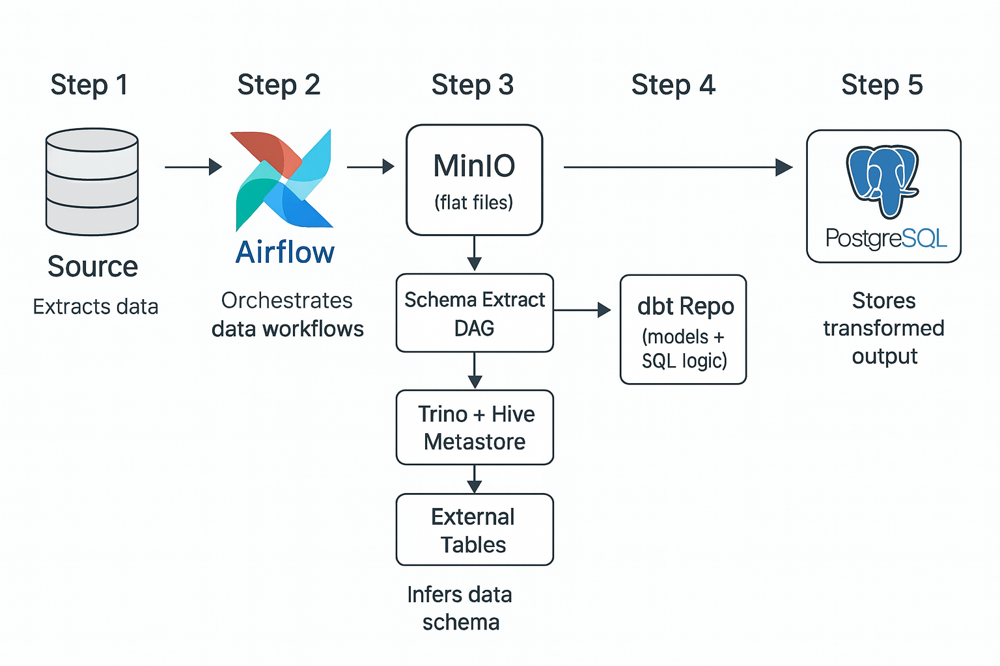

# 🛰️ GitOps Kubernetes Data Platform

This repository hosts a near production-grade, fully open-source **on-premises modern data platform**, orchestrated using **GitOps practices** with [Argo CD]

The architecture mirrors that of a **cloud-native data lakehouse**, tailored for private infrastructure. It enables scalable, modular, and version-controlled **data ingestion, transformation, cataloging, and governance** workflows.

---

## 🌉 Platform Overview & Capabilities

The platform is designed to power **end-to-end ELT pipelines** using the following functional modules:

### 🔁 Data Ingestion

- Schedule and orchestrate batch jobs using **Airflow DAGs**.
- Supports diverse data sources: **external APIs, FTP servers, internal systems, and web scrapers**.
- DAGs are containerized, versioned in GitHub, and deployed via CI/CD pipelines.
- Output is written as structured/unstructured files (CSV, JSON, Parquet) to **MinIO**, forming the **raw/staging layer**.

### 📄 Schema Discovery & Cataloging

- Airflow DAGs detect and extract schema metadata from newly ingested files.
- Schemas are committed to a Git-based **Schema Repository** as YAML/SQL/JSON definitions.
- Hive Metastore (backed by PostgreSQL DB) is synchronized with the schema repo, creating **external tables** dynamically with partition support.

### 🔍 Query Layer & Federated SQL

- **Trino** connects to Hive Metastore and MinIO to expose external tables using schema-on-read.
- Features include:
  - Push-down filtering and file format optimizations (Parquet, ORC)
  - Federated querying across MinIO and PostgreSQL
- Used by both **Airflow SQL tasks** and **dbt models**.

### 🔧 Data Transformation

- **dbt** (WIP) enables modular SQL transformations:
  - Source/staging models query Trino
  - Models compiled and executed via `dbt CLI` inside Kubernetes pods
  - Final results are stored in **PostgreSQL**, forming the structured warehouse
- CI/CD pipeline supports model testing, documentation, and version-controlled deployment.

### 🔐 Secure Secrets & Credentials Management

- **Vault** stores secrets such as DB credentials, API tokens, and S3 keys.
- **External Secrets Operator (ESO)** syncs secrets into Kubernetes and injects them into workloads securely.
- Paths follow a structured pattern (e.g., `kv/data/app-secrets/airflow/connection`).

### 🛡️ Networking & Access Control

- **Ingress-NGINX** handles internal domain routing (e.g., `airflow.app.com`, `vault.app.com`).
- **MetalLB** assigns a static IP (e.g., `192.168.1.200`) to the ingress controller.
- Internal DNS (e.g., Pi-hole) maps services to that IP.
- **cert-manager** (WIP) will issue self-signed/internal TLS certificates for HTTPS.

### ⚙️ CI/CD Automation & GitOps Workflow

- Custom Helm charts define each application deployment.
- **Argo CD** continuously monitors and syncs this Git repo to Kubernetes.
- **GitHub Actions** automate:
  - Docker builds for Airflow and dbt image updates
  - Updating `values.yaml` with new image tags
  - Triggering Argo CD to sync the latest changes

---

## 📦 Components and Responsibilities

| Component       | Description |
|----------------|-------------|
| **Argo CD**     | GitOps engine managing declarative Kubernetes apps synced from GitHub |
| **Apache Airflow** | Orchestrates ingestion and schema extraction DAGs using KubernetesExecutor |
| **MinIO**       | S3-compatible object store for raw and staged data |
| **Hive Metastore** | Stores metadata for external tables, synced from schema repo |
| **Trino**       | Distributed SQL engine for querying external tables in MinIO and PostgreSQL |
| **dbt (WIP)**   | SQL transformation framework reading from Trino and writing to PostgreSQL |
| **PostgreSQL**  | Target warehouse and metadata store for Hive |
| **Vault**       | Stores sensitive credentials centrally |
| **External Secrets Operator (ESO)** | Dynamically injects secrets from Vault into Kubernetes |
| **Ingress-NGINX** | Internal HTTP routing based on domain names |
| **cert-manager (WIP)** | Issues internal TLS certificates |
| **MetalLB (WIP)** | Assigns internal static IPs to LoadBalancer services |
| **Schema Repository (WIP)**  | Git repo for storing and versioning schema metadata |
| **dbt Repository (WIP)** | Git repo for dbt models and transformation logic |

---

## 🌐 DNS Configuration Example

```txt
airflow.app.com   → 192.168.1.200
minio.app.com     → 192.168.1.200
vault.app.com     → 192.168.1.200
```

---

## 🧠 Example Data Pipeline Summary



---

## 📌 Planned Features

- [ ] **dbt Integration** for modeling raw/staged data into dimensional warehouse tables
- [ ] **Schema Git Repo** to store and manage column/partition definitions as code
- [ ] **dbt Git Repo** to version control transformation logic
- [ ] **Prometheus + Grafana** for observability (metrics, dashboards, alerts)
